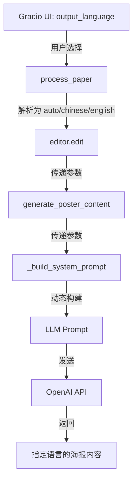

# v1.3.9 多语言输出支持

## 🌐 功能概述

Paper2Poster-Web v1.3.9 新增了**输出语言选择**功能，允许用户指定海报内容使用中文还是英文，无论论文原文是什么语言。

### 核心价值

- ✅ **灵活性**: 英文论文可生成中文海报，中文论文可生成英文海报
- ✅ **国际化**: 满足国际会议和国内展示的不同需求
- ✅ **智能翻译**: 利用 LLM 的强大翻译能力，自动转换语言
- ✅ **保持专业**: 翻译后仍保持学术专业性和准确性

---

## 🎯 使用场景

### 场景 1: 英文论文 → 中文海报

**需求**: 准备国内会议或展示，需要中文海报

**操作**:
1. 上传英文 PDF 论文
2. 选择 "🌐 输出语言" → "中文 (Chinese)"
3. 生成海报

**效果**:
- 所有内容自动翻译为中文
- 保持学术术语准确性
- 适合国内学术交流

### 场景 2: 中文论文 → 英文海报

**需求**: 参加国际会议，需要英文海报

**操作**:
1. 上传中文 PDF 论文
2. 选择 "🌐 输出语言" → "英文 (English)"
3. 生成海报

**效果**:
- 所有内容自动翻译为英文
- 符合国际学术规范
- 适合国际学术交流

### 场景 3: 保持原文语言（默认）

**需求**: 论文和海报语言一致

**操作**:
1. 上传论文（任何语言）
2. 保持 "🌐 输出语言" → "自动检测 (Auto)"（默认）
3. 生成海报

**效果**:
- 海报语言与论文语言一致
- 无需翻译，速度更快
- 原汁原味保留原文表达

---

## 🔧 技术实现

### UI 组件

**位置**: Gradio Web UI → 高级功能区

**组件类型**: `gr.Radio`

**选项**:
```python
gr.Radio(
    choices=[
        "自动检测 (Auto)",     # 默认，保持原文语言
        "中文 (Chinese)",       # 强制输出中文
        "英文 (English)"        # 强制输出英文
    ],
    value="自动检测 (Auto)",
    label="🌐 输出语言",
    info="指定海报内容的语言。自动检测会根据论文原文语言输出"
)
```

### 参数传递流程



### Prompt 动态生成

**代码实现** (`src/editor.py`):

```python
def _build_system_prompt(self, abstract_max_words: int = 130, output_language: str = "auto") -> str:
    """构建系统提示词"""
    # 根据语言选择构建语言要求
    if output_language == "chinese":
        language_instruction = (
            "2. **重要**：所有内容必须用中文输出，包括标题、摘要、各部分内容等。"
            "即使论文是英文的，也要翻译为中文。"
        )
    elif output_language == "english":
        language_instruction = (
            "2. **Important**: All content must be output in English, including title, "
            "abstract, and all sections. If the paper is in Chinese, translate it to English."
        )
    else:  # auto
        language_instruction = (
            "2. 所有内容必须用论文的源语言输出（中文论文用中文，英文论文用英文）"
        )
    
    return f"""你是一个专业的学术海报设计师...
    
要求：
1. 请忽略无关的致谢或附录部分
{language_instruction}
3. 对于 section 的 content 字段...
    """
```

**效果对比**:

| 模式 | Prompt 语言指令 | LLM 行为 |
|------|----------------|---------|
| **自动检测** | "用论文的源语言输出" | 中文论文→中文海报<br>英文论文→英文海报 |
| **中文** | "**重要**：所有内容必须用中文输出" | 任何论文→中文海报 |
| **英文** | "**Important**: All content must be output in English" | 任何论文→英文海报 |

---

## 📊 使用建议

### 模型选择

**推荐模型**:

| 任务类型 | 推荐模型 | 原因 |
|---------|---------|------|
| **保持原文** | GPT-3.5-turbo, GPT-4o-mini | 速度快，成本低 |
| **英译中** | GPT-4, GPT-4o | 翻译质量高，术语准确 |
| **中译英** | GPT-4, GPT-4o | 翻译质量高，符合学术规范 |

**为什么需要更强的模型**:
- 翻译任务比简单提取更复杂
- 需要理解上下文和专业术语
- 需要保持学术表达的准确性

### Abstract 字数建议

**中文输出**:
- 推荐字数: 130-150 字
- 原因: 中文信息密度高，相同内容字数较少

**英文输出**:
- 推荐字数: 180-220 字
- 原因: 英文表达较冗长，需要更多字数

### 温度 (Temperature) 设置

| 模式 | 推荐温度 | 说明 |
|------|---------|------|
| **自动检测** | 0.3-0.5 | 标准创造性 |
| **翻译模式** | 0.1-0.3 | 更低温度，保证翻译准确性 |

---

## 🧪 测试示例

### 测试 1: 英文论文 → 中文海报

**输入**:
- 论文: `Deep Learning for Computer Vision` (英文)
- 输出语言: "中文 (Chinese)"

**预期输出**:
```json
{
  "title": "用于计算机视觉的深度学习",
  "abstract": "本文提出了一种新型深度学习架构...",
  "introduction": {
    "title": "引言",
    "content": "- 计算机视觉是人工智能的重要分支\n- 深度学习方法..."
  },
  ...
}
```

### 测试 2: 中文论文 → 英文海报

**输入**:
- 论文: `基于深度学习的图像识别研究` (中文)
- 输出语言: "英文 (English)"

**预期输出**:
```json
{
  "title": "Image Recognition Research Based on Deep Learning",
  "abstract": "This paper proposes a novel deep learning architecture...",
  "introduction": {
    "title": "Introduction",
    "content": "- Computer vision is an important branch of AI\n- Deep learning methods..."
  },
  ...
}
```

### 测试 3: 自动检测

**输入**:
- 论文: 任何语言
- 输出语言: "自动检测 (Auto)"

**预期输出**:
- 保持论文原文语言

---

## 💡 最佳实践

### 1. 选择合适的模式

```python
# 场景判断
if 论文语言 == 海报需求语言:
    选择 "自动检测 (Auto)"  # 最快，成本最低
elif 需要翻译:
    选择 "中文" 或 "英文"   # 明确指定目标语言
```

### 2. 检查翻译质量

**生成后检查**:
- ✅ 专业术语是否准确
- ✅ 缩写是否保留（如 CNN, GPU）
- ✅ 数字、公式是否正确
- ✅ 引用格式是否规范

**如不满意**:
- 调整模型（使用 GPT-4）
- 降低温度（0.1-0.2）
- 增加 Abstract 字数限制

### 3. 混合语言处理

**论文包含中英文混合内容**:
- 选择 "自动检测"
- LLM 会自动识别主要语言
- 专业术语通常保持英文

### 4. 节省成本

**如何降低翻译成本**:
1. 只在必要时使用翻译模式
2. 使用 GPT-4o-mini 先测试
3. 满意后再用 GPT-4 生成正式版
4. 调整 `max_images` 减少 token 消耗

---

## ⚠️ 注意事项

### 翻译局限性

1. **专业术语**: LLM 可能对某些领域特定术语翻译不准确
2. **上下文**: 长论文可能因截断导致翻译不连贯
3. **公式**: 数学公式通常保持原样，不翻译
4. **图表**: 图片中的文字不会被翻译

### 解决方案

**术语不准确**:
- 在论文中明确定义术语
- 使用更强的模型（GPT-4）
- 手动调整生成的 JSON

**翻译不流畅**:
- 降低温度（0.1-0.2）
- 增加 max_tokens
- 重新生成

**图片文字**:
- 使用视觉分析功能
- 手动编辑海报

---

## 🔄 与其他功能的兼容性

### 视觉分析

**兼容**: ✅ 完全兼容

- 图片分析结果自动翻译
- Caption 和 Description 使用目标语言

### Abstract 字数控制

**兼容**: ✅ 完全兼容

- 字数限制对中英文都有效
- 中文按字符计数，英文按单词计数

### 模板系统

**兼容**: ✅ 完全兼容

- 所有模板支持中英文显示
- TailwindCSS 自动适配字体

---

## 📚 相关文档

- **Prompt Engineering**: 如何优化翻译质量
- **LLM 模型选择**: 不同模型的翻译能力对比
- **国际化海报设计**: 中英文海报的设计差异

---

## 🚀 未来优化方向

### 可能的增强功能

1. **更多语言支持**:
   - 日语、韩语、法语、德语等
   - 多语言对照海报

2. **术语词典**:
   - 自定义专业术语翻译
   - 领域特定翻译规则

3. **翻译质量评估**:
   - 自动检测翻译质量
   - 提示用户可能的问题

4. **批量翻译**:
   - 同一论文生成多语言版本
   - 自动对比和优化

---

**版本**: v1.3.9  
**日期**: 2025-12-18  
**功能**: 多语言输出支持（中文/英文/自动）  
**作者**: Paper2Poster-Web 团队

